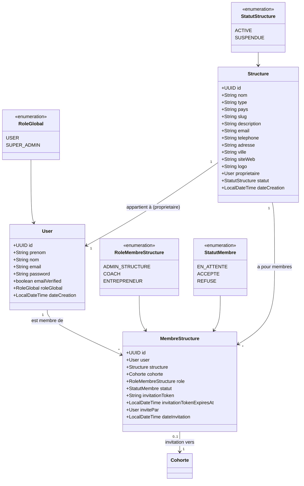
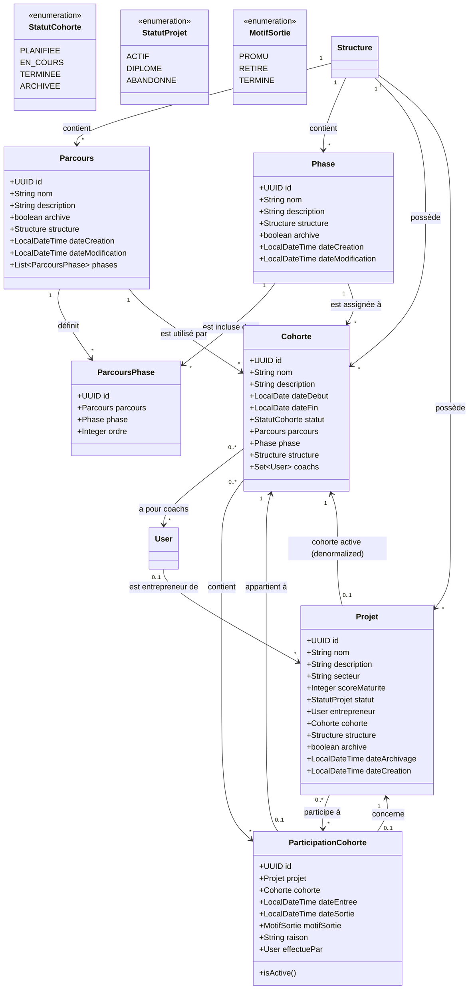
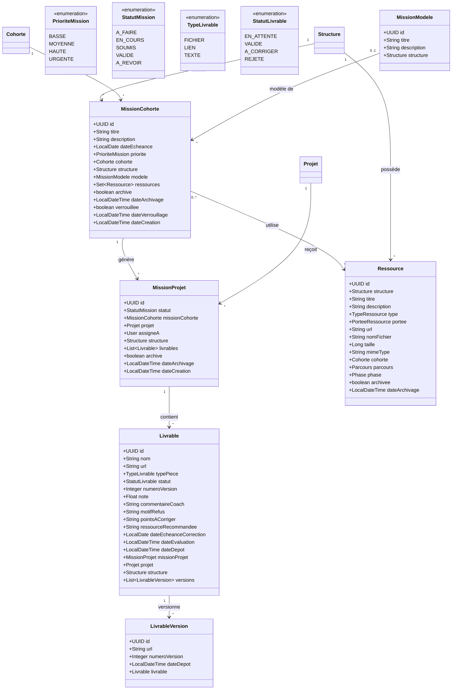
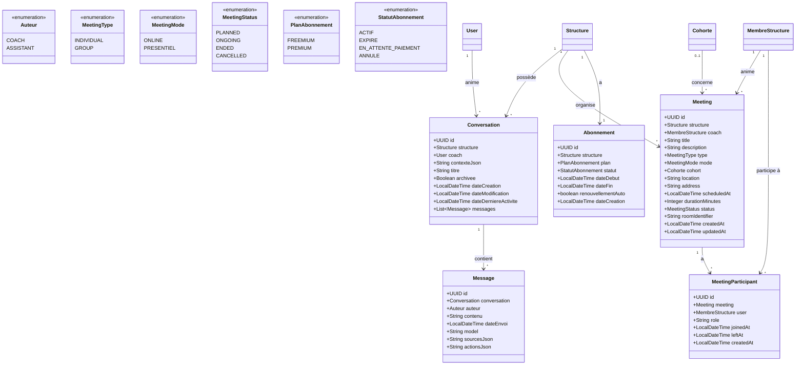
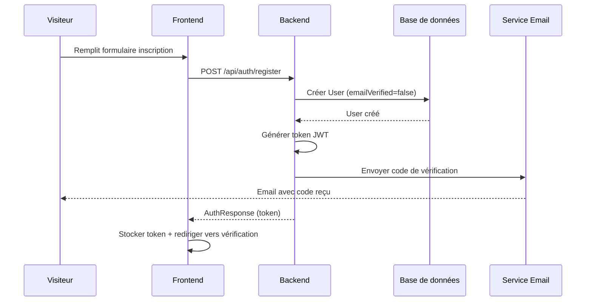
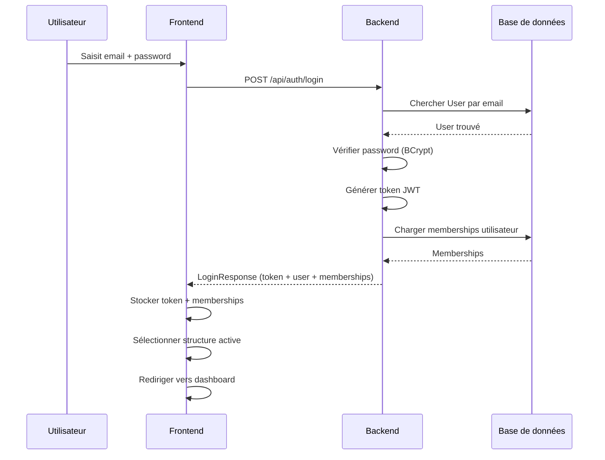
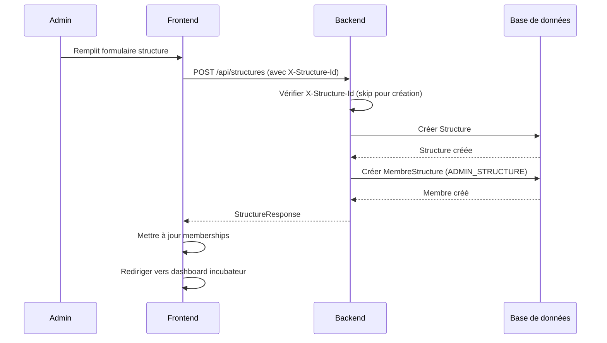
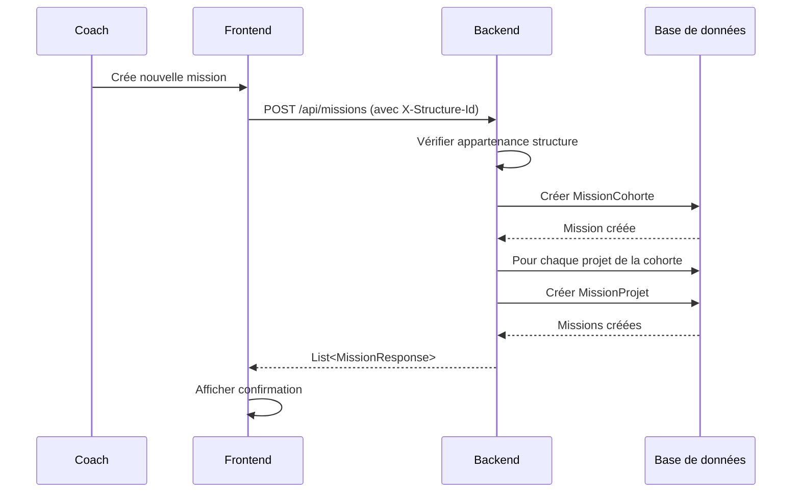
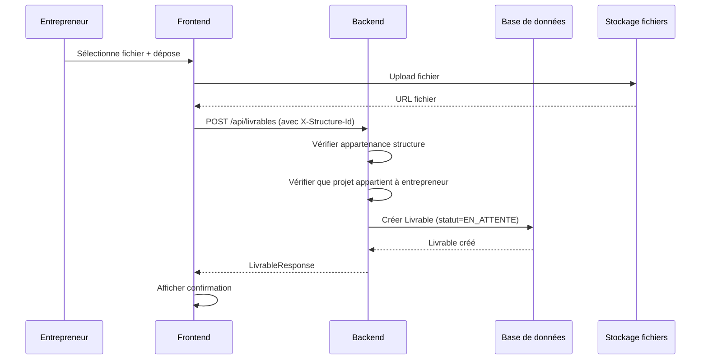
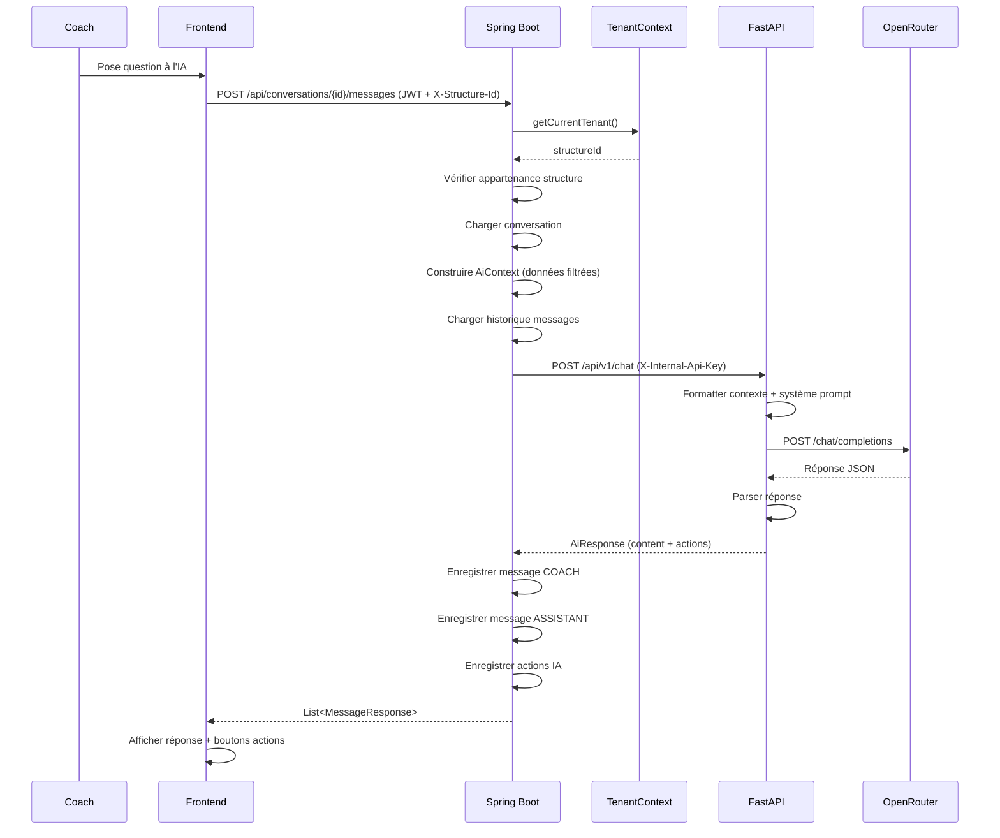

# JAPPO — Documentation technique et fonctionnelle

## 1. Présentation

### 1.1 Qu'est-ce que JAPPO ?

JAPPO est une plateforme SaaS multi-tenant dédiée aux structures d'accompagnement et incubateurs pour la gestion de parcours d'incubation de startups et entrepreneurs. La plateforme permet de suivre des cohortes, projets, missions, livrables, réunions et intègre un assistant IA pour aider les coachs dans leur travail d'accompagnement.

### 1.2 Problème métier

Les incubateurs et structures d'accompagnement font face à plusieurs défis :
- Gestion manuelle et dispersée des dossiers entrepreneurs
- Difficulté à suivre la progression dans les parcours d'incubation
- Manque de visibilité sur l'avancement des missions et livrables
- Processus d'évaluation et de feedback chronophages
- Communication fragmentée avec les entrepreneurs
- Difficulté à analyser les données et tendances
- Manque d'outils d'automatisation pour les tâches répétitives

### 1.3 Utilisateurs ciblés

- **Incubateurs et accélérateurs** : Structures qui accompagnent des startups
- **Coachs et mentors** : Personnes qui encadrent les entrepreneurs
- **Entrepreneurs** : Porteurs de projets en incubation
- **Administrateurs de structures** : Gestionnaires de l'incubateur

### 1.4 Proposition de valeur

JAPPO centralise et digitalise l'ensemble du processus d'incubation :
- Suivi structuré des parcours et cohortes
- Gestion des missions et livrables avec workflow de validation
- Visibilité en temps réel de la progression
- Assistant IA pour aider les coachs
- Réunions vidéo intégrées
- Gestion des ressources pédagogiques
- Automatisation partielle des tâches
- Tableaux de bord et analytics

### 1.5 Fonctionnement global

JAPPO fonctionne selon un modèle SaaS multi-tenant :
- Chaque structure (incubateur) est un tenant indépendant
- Les données sont isolées par structure
- Les utilisateurs peuvent appartenir à plusieurs structures avec des rôles différents
- Le système sépare clairement les espaces incubateur (coaches/admins) et entrepreneur

### 1.6 Modèle SaaS

JAPPO utilise un modèle :
- **Freemium** : Fonctionnalités de base gratuites
- **Premium** : Fonctionnalités avancées payantes (assistant IA, nombre illimité d'entrepreneurs, etc.)
- **Paiement via intégrations locales** :  PayDunya (solutions de paiement africaines)

### 1.7 Fonctionnement multi-tenant

Le multi-tenant est implémenté via :
- En-tête HTTP `X-Structure-Id` transmis par le frontend
- `TenantContext` (ThreadLocal) côté backend pour stocker l'ID de structure active
- Filtrage automatique des requêtes par structure
- Vérification des droits d'appartenance à la structure
- Isolation complète des données entre structures

### 1.8 Principales fonctionnalités

**Espace Incubateur :**
- Gestion des structures et équipes
- Création et gestion des parcours et phases
- Création et gestion des cohortes
- Gestion des entrepreneurs et projets
- Création et attribution de missions
- Validation des livrables
- Planification et gestion des réunions
- Gestion des ressources pédagogiques
- Assistant IA pour les coachs
- Dashboard et analytics
- Gestion des abonnements

**Espace Entrepreneur :**
- Vue de leur parcours de progression
- Gestion de leur projet
- Suivi des missions assignées
- Dépôt de livrables
- Participation aux réunions
- Accès aux ressources

### 1.9 Place de l'IA

L'IA dans JAPPO joue un rôle d'assistant pour les coachs :
- Répond aux questions sur les cohortes, projets, entrepreneurs
- Analyse les données de progression
- Propose des actions métier (création de missions, archivage, etc.)
- Les actions proposées nécessitent une confirmation humaine avant exécution
- Utilise un contexte métier filtré et sécurisé
- Historique des conversations conservé

### 1.10 Place de l'automatisation

L'automatisation dans JAPPO est limitée :
- **n8n** : Configuré mais pas de workflows actifs détectés dans le code
- **Webhooks** : Intégration pour les paiements (PayDunya IPN)
- **Jobs planifiés** : Expiration des abonnements
- **Pas d'automatisation IA directe** : Toutes les actions IA nécessitent validation humaine

### 1.11 Intégrations externes

**Actives :**
- **Google OAuth** : Authentification via Google
- **LiveKit** : Service de visioconférence pour les réunions
- **PayTech / PayDunya** : Passerelles de paiement africaines
- **SMTP Gmail** : Envoi d'emails (vérification, invitations)
- **OpenRouter** : Fournisseur de modèles LLM pour l'IA

**Configurées mais non actives :**
- **n8n** : Orchestrateur de workflows (pas de workflows détectés)

## 2. Les différents acteurs

### 2.1 Acteurs internes

| Acteur | Description | Responsabilités | Fonctionnalités accessibles | Permissions |
|--------|-------------|----------------|---------------------------|-------------|
| **ADMIN_STRUCTURE** | Administrateur de l'incubateur | Gestion complète de la structure | - Créer/modifier structure<br>- Gérer l'équipe<br>- Créer parcours/phases<br>- Créer cohortes<br>- Inviter/gérer entrepreneurs<br>- Toutes les opérations incubateur | Rôle complet sur la structure |
| **COACH** | Coach/Mentor | Accompagnement des entrepreneurs | - Voir cohortes<br>- Créer/assigner missions<br>- Valider livrables<br>- Planifier réunions<br>- Utiliser assistant IA<br>- Accéder dashboard | Opérations d'accompagnement sur la structure |
| **ENTREPRENEUR** | Porteur de projet | Suivre son parcours d'incubation | - Voir son parcours<br>- Gérer son projet<br>- Voir ses missions<br>- Déposer livrables<br>- Participer aux réunions<br>- Accéder aux ressources | Accès limité à son propre projet et données liées |
| **SUPER_ADMIN** | Administrateur plateforme | Gestion globale (multi-structures) | - Voir toutes les structures<br>- Gérer les abonnements<br>- Voir les transactions<br>- Accès admin global | Accès transversal aux structures |

### 2.2 Acteurs externes

| Acteur | Rôle | Intégration |
|--------|------|-------------|
| **Google** | Authentification OAuth | Google OAuth 2.0 |
| **LiveKit** | Service de visioconférence | LiveKit Server SDK |
| **PayTech** | Passerelle de paiement | API REST + Webhooks |
| **PayDunya** | Passerelle de paiement | API REST + IPN Webhooks |
| **Gmail SMTP** | Service d'envoi d'emails | JavaMail / Spring Mail |
| **OpenRouter** | Fournisseur de modèles LLM | API OpenAI-compatible |
| **n8n** | Orchestrateur de workflows | Configuré mais workflows non détectés |

## 3. Besoins fonctionnels

### 3.1 Authentification

| ID | Besoin fonctionnel | Acteur | Priorité | État |
|----|-------------------|--------|----------|------|
| BF-01 | Inscription utilisateur | Visiteur | Haute | Existant |
| BF-02 | Connexion email/mot de passe | Utilisateur | Haute | Existant |
| BF-03 | Connexion Google OAuth | Utilisateur | Moyenne | Existant |
| BF-04 | Vérification email par code | Utilisateur | Haute | Existant |
| BF-05 | Réinitialisation mot de passe | Utilisateur | Moyenne | Existant |
| BF-06 | Changement mot de passe | Utilisateur | Moyenne | Existant |
| BF-07 | Acceptation d'invitation | Utilisateur invité | Haute | Existant |
| BF-08 | Déconnexion | Utilisateur | Haute | Existant |

### 3.2 Gestion des structures

| ID | Besoin fonctionnel | Acteur | Priorité | État |
|----|-------------------|--------|----------|------|
| BF-09 | Créer une structure | ADMIN_STRUCTURE | Haute | Existant |
| BF-10 | Modifier les informations structure | ADMIN_STRUCTURE | Moyenne | Existant |
| BF-11 | Voir mes structures | Utilisateur | Haute | Existant |
| BF-12 | Choisir une structure active | Utilisateur | Haute | Existant |
| BF-13 | Archiver une structure | SUPER_ADMIN | Basse | Prévu |

### 3.3 Gestion des membres

| ID | Besoin fonctionnel | Acteur | Priorité | État |
|----|-------------------|--------|----------|------|
| BF-14 | Inviter un membre par email | ADMIN_STRUCTURE | Haute | Existant |
| BF-15 | Accepter une invitation | Utilisateur | Haute | Existant |
| BF-16 | Gérer les rôles des membres | ADMIN_STRUCTURE | Moyenne | Existant |
| BF-17 | Voir l'équipe de la structure | ADMIN_STRUCTURE/COACH | Moyenne | Existant |
| BF-18 | Supprimer un membre | ADMIN_STRUCTURE | Basse | Prévu |

### 3.4 Gestion des cohortes

| ID | Besoin fonctionnel | Acteur | Priorité | État |
|----|-------------------|--------|----------|------|
| BF-19 | Créer une cohorte | ADMIN_STRUCTURE | Haute | Existant |
| BF-20 | Modifier une cohorte | ADMIN_STRUCTURE | Moyenne | Existant |
| BF-21 | Archiver/restaurer une cohorte | ADMIN_STRUCTURE | Moyenne | Existant |
| BF-22 | Affecter des coachs à une cohorte | ADMIN_STRUCTURE | Haute | Existant |
| BF-23 | Voir les cohortes | ADMIN_STRUCTURE/COACH | Haute | Existant |
| BF-24 | Voir le détail d'une cohorte | ADMIN_STRUCTURE/COACH | Haute | Existant |
| BF-25 | Inviter des entrepreneurs dans une cohorte | ADMIN_STRUCTURE | Haute | Existant |
| BF-26 | Promotion groupée de projets | ADMIN_STRUCTURE/COACH | Haute | Existant |

### 3.5 Gestion des entrepreneurs

| ID | Besoin fonctionnel | Acteur | Priorité | État |
|----|-------------------|--------|----------|------|
| BF-27 | Voir la liste des entrepreneurs | ADMIN_STRUCTURE/COACH | Haute | Existant |
| BF-28 | Voir le détail d'un entrepreneur | ADMIN_STRUCTURE/COACH | Haute | Existant |
| BF-29 | Créer un projet pour entrepreneur | ADMIN_STRUCTURE | Haute | Existant |
| BF-30 | Voir les projets d'un entrepreneur | ADMIN_STRUCTURE/COACH | Haute | Existant |

### 3.6 Gestion des projets

| ID | Besoin fonctionnel | Acteur | Priorité | État |
|----|-------------------|--------|----------|------|
| BF-31 | Créer un projet | ADMIN_STRUCTURE/ENTREPRENEUR | Haute | Existant |
| BF-32 | Modifier un projet | ADMIN_STRUCTURE/ENTREPRENEUR | Moyenne | Existant |
| BF-33 | Archiver/restaurer un projet | ADMIN_STRUCTURE | Moyenne | Existant |
| BF-34 | Voir les projets de la structure | ADMIN_STRUCTURE/COACH | Haute | Existant |
| BF-35 | Voir le détail d'un projet | ADMIN_STRUCTURE/COACH/ENTREPRENEUR | Haute | Existant |
| BF-36 | Voir mes projets | ENTREPRENEUR | Haute | Existant |

### 3.7 Gestion des parcours

| ID | Besoin fonctionnel | Acteur | Priorité | État |
|----|-------------------|--------|----------|------|
| BF-37 | Créer un parcours | ADMIN_STRUCTURE | Haute | Existant |
| BF-38 | Modifier un parcours | ADMIN_STRUCTURE | Moyenne | Existant |
| BF-39 | Archiver un parcours | ADMIN_STRUCTURE | Moyenne | Existant |
| BF-40 | Créer une phase | ADMIN_STRUCTURE | Haute | Existant |
| BF-41 | Modifier une phase | ADMIN_STRUCTURE | Moyenne | Existant |
| BF-42 | Ajouter une phase à un parcours | ADMIN_STRUCTURE | Haute | Existant |
| BF-43 | Voir les parcours | ADMIN_STRUCTURE/COACH | Haute | Existant |
| BF-44 | Utiliser un parcours standard | ADMIN_STRUCTURE | Haute | Existant |

### 3.8 Gestion des missions

| ID | Besoin fonctionnel | Acteur | Priorité | État |
|----|-------------------|--------|----------|------|
| BF-45 | Créer une mission de cohorte | ADMIN_STRUCTURE/COACH | Haute | Existant |
| BF-46 | Créer une mission individuelle | ADMIN_STRUCTURE/COACH | Haute | Existant |
| BF-47 | Modifier une mission | ADMIN_STRUCTURE/COACH | Moyenne | Existant |
| BF-48 | Archiver/restaurer une mission | ADMIN_STRUCTURE/COACH | Moyenne | Existant |
| BF-49 | Voir les missions de cohorte | ADMIN_STRUCTURE/COACH | Haute | Existant |
| BF-50 | Voir mes missions | ENTREPRENEUR | Haute | Existant |
| BF-51 | Voir le détail d'une mission | Tous | Haute | Existant |
| BF-52 | Mettre à jour le statut d'une mission | COACH/ENTREPRENEUR | Haute | Existant |
| BF-53 | Supprimer une mission | ADMIN_STRUCTURE/COACH | Basse | Existant |

### 3.9 Gestion des livrables

| ID | Besoin fonctionnel | Acteur | Priorité | État |
|----|-------------------|--------|----------|------|
| BF-54 | Déposer un livrable | ENTREPRENEUR | Haute | Existant |
| BF-55 | Valider un livrable | COACH | Haute | Existant |
| BF-56 | Demander une correction | COACH | Haute | Existant |
| BF-57 | Rejeter un livrable | COACH | Moyenne | Existant |
| BF-58 | Voir les livrables d'une mission | COACH | Haute | Existant |
| BF-59 | Voir mes livrables | ENTREPRENEUR | Haute | Existant |
| BF-60 | Noter un livrable | COACH | Moyenne | Existant |

### 3.10 Gestion des réunions

| ID | Besoin fonctionnel | Acteur | Priorité | État |
|----|-------------------|--------|----------|------|
| BF-61 | Créer une réunion | COACH | Haute | Existant |
| BF-62 | Planifier une réunion individuelle | COACH | Haute | Existant |
| BF-63 | Planifier une réunion de groupe | COACH | Haute | Existant |
| BF-64 | Rejoindre une réunion | Tous | Haute | Existant |
| BF-65 | Quitter une réunion | Tous | Moyenne | Existant |
| BF-66 | Terminer une réunion | COACH | Moyenne | Existant |
| BF-67 | Voir mes réunions | Tous | Haute | Existant |
| BF-68 | Voir les réunions de la structure | ADMIN_STRUCTURE/COACH | Haute | Existant |

### 3.11 Gestion des ressources

| ID | Besoin fonctionnel | Acteur | Priorité | État |
|----|-------------------|--------|----------|------|
| BF-69 | Créer une ressource | ADMIN_STRUCTURE/COACH | Moyenne | Existant |
| BF-70 | Modifier une ressource | ADMIN_STRUCTURE/COACH | Basse | Existant |
| BF-71 | Archiver une ressource | ADMIN_STRUCTURE/COACH | Basse | Existant |
| BF-72 | Attacher une ressource à une mission | ADMIN_STRUCTURE/COACH | Moyenne | Existant |
| BF-73 | Voir les ressources | Tous | Moyenne | Existant |
| BF-74 | Accéder aux ressources de ma cohorte | ENTREPRENEUR | Moyenne | Existant |

### 3.12 Gestion des conversations IA

| ID | Besoin fonctionnel | Acteur | Priorité | État |
|----|-------------------|--------|----------|------|
| BF-75 | Créer une conversation IA | COACH | Haute | Existant |
| BF-76 | Envoyer un message à l'IA | COACH | Haute | Existant |
| BF-77 | Modifier le contexte d'une conversation | COACH | Moyenne | Existant |
| BF-78 | Renommer une conversation | COACH | Basse | Existant |
| BF-79 | Archiver une conversation | COACH | Basse | Existant |
| BF-80 | Restaurer une conversation | COACH | Basse | Existant |
| BF-81 | Supprimer une conversation | COACH | Basse | Existant |
| BF-82 | Voir l'historique des conversations | COACH | Haute | Existant |
| BF-83 | Valider une action IA proposée | COACH | Haute | Existant |

### 3.13 Gestion des paiements

| ID | Besoin fonctionnel | Acteur | Priorité | État |
|----|-------------------|--------|----------|------|
| BF-84 | Choisir un abonnement | ADMIN_STRUCTURE | Haute | Existant |
| BF-85 | Initier un paiement | ADMIN_STRUCTURE | Haute | Existant |
| BF-86 | Redirection vers passerelle | ADMIN_STRUCTURE | Haute | Existant |
| BF-87 | Confirmation de paiement | Système | Haute | Existant |
| BF-88 | Webhook de confirmation | Système | Haute | Existant |
| BF-89 | Activation de l'abonnement | Système | Haute | Existant |
| BF-90 | Gestion des échecs de paiement | Système | Moyenne | Existant |
| BF-91 | Voir les abonnements | SUPER_ADMIN | Haute | Existant |
| BF-92 | Voir les transactions | SUPER_ADMIN | Haute | Existant |

### 3.14 Dashboard

| ID | Besoin fonctionnel | Acteur | Priorité | État |
|----|-------------------|--------|----------|------|
| BF-93 | Voir les statistiques globales | ADMIN_STRUCTURE/COACH | Haute | Existant |
| BF-94 | Voir les projets en alerte | ADMIN_STRUCTURE/COACH | Haute | Existant |
| BF-95 | Voir les livrables récents | ADMIN_STRUCTURE/COACH | Moyenne | Existant |
| BF-96 | Voir la répartition par phase | ADMIN_STRUCTURE/COACH | Moyenne | Existant |
| BF-97 | Voir mon parcours | ENTREPRENEUR | Haute | Existant |

### 3.15 Paramètres

| ID | Besoin fonctionnel | Acteur | Priorité | État |
|----|-------------------|--------|----------|------|
| BF-98 | Modifier mon profil | Utilisateur | Moyenne | Existant |
| BF-99 | Gérer les paramètres de la structure | ADMIN_STRUCTURE | Moyenne | Existant |

## 4. Besoins non fonctionnels

### 4.1 Sécurité

| ID | Besoin non fonctionnel | Description | Solution technique |
|----|----------------------|-------------|-------------------|
| BN-01 | Authentification JWT | Tokens JWT pour les requêtes authentifiées | Spring Security + JJWT |
| BN-02 | Hachage des mots de passe | BCrypt pour le stockage des passwords | BCryptPasswordEncoder |
| BN-03 | Contrôle d'accès RBAC | Rôles par structure (ADMIN_STRUCTURE, COACH, ENTREPRENEUR) | @PreAuthorize + JwtAuthenticationFilter |
| BN-04 | Isolation multi-tenant | Séparation des données par structure | TenantContext + X-Structure-Id header |
| BN-05 | Validation des entrées | Validation des DTOs | Jakarta Validation |
| BN-06 | Protection des endpoints | Séparation endpoints publics/privés | SecurityConfig |
| BN-07 | Gestion des secrets | Variables d'environnement | .env + Dotenv Java |
| BN-08 | CORS | Autorisation des origines autorisées | CorsConfiguration |
| BN-09 | Sécurité des API inter-services | Clé API pour service IA | X-Internal-Api-Key header |
| BN-10 | Audit des actions IA | Traçabilité des actions proposées/exécutées | AiAction entity + statuts |

### 4.2 Performance

| ID | Besoin non fonctionnel | Description | Solution technique |
|----|----------------------|-------------|-------------------|
| BN-11 | Temps de réponse API | Réponses < 500ms pour endpoints standards | Spring Boot optimisation |
| BN-12 | Pagination | Pagination des listes pour éviter surcharge | PageRequest + limites |
| BN-13 | Chargement des données | Lazy loading des relations JPA | FetchType.LAZY |
| BN-14 | Appels IA | Timeout configurable pour appels LLM | Timeout 60s + AsyncHttpClient |
| BN-15 | Traitements asynchrones | Non bloquant pour les opérations longues | Async/await Python |

### 4.3 Scalabilité

| ID | Besoin non fonctionnel | Description | Solution technique |
|----|----------------------|-------------|-------------------|
| BN-16 | Architecture SaaS | Support multi-structures | Multi-tenant par header |
| BN-17 | Nombre de structures | Support de nombreuses structures | Isolation par ID structure |
| BN-18 | Nombre d'utilisateurs | Support de nombreux utilisateurs | Stateless JWT |
| BN-19 | Croissance des données | Migration DB via Flyway | Flyway migrations |

### 4.4 Disponibilité

| ID | Besoin non fonctionnel | Description | Solution technique |
|----|----------------------|-------------|-------------------|
| BN-20 | Gestion des erreurs | Graceful degradation | Try-catch + messages utilisateur |
| BN-21 | Résilience IA | Fallback si LLM indisponible | FakeAiService + messages d'erreur |
| BN-22 | Logs | Logging structuré | SLF4J + Logback |
| BN-23 | Monitoring | Health checks | Actuator (partiellement configuré) |

### 4.5 Maintenabilité

| ID | Besoin non fonctionnel | Description | Solution technique |
|----|----------------------|-------------|-------------------|
| BN-24 | Architecture modulaire | Séparation des responsabilités | Package par domaine |
| BN-25 | Conventions | Standards de code | Lombok + patterns Spring |
| BN-26 | Tests | Tests unitaires et intégration | JUnit5 + Vitest |
| BN-27 | Documentation | API documentation | SpringDoc OpenAPI |

### 4.6 Compatibilité

| ID | Besoin non fonctionnel | Description | Solution technique |
|----|----------------------|-------------|-------------------|
| BN-28 | Navigateurs | Support navigateurs modernes | Angular 21 + CSS standard |
| BN-29 | Responsive | Adaptation mobile | Tailwind CSS + responsive design |
| BN-30 | API REST | Format standard REST | Spring MVC + JSON |
| BN-31 | Formats JSON | Communication JSON standard | Jackson |

### 4.7 Confidentialité

| ID | Besoin non fonctionnel | Description | Solution technique |
|----|----------------------|-------------|-------------------|
| BN-32 | Données entrepreneurs | Protection des données personnelles | Isolation tenant + RGPD implicit |
| BN-33 | Données projets | Confidentialité des projets | Accès restreint par rôle |
| BN-34 | Conversations IA | Historique privé par coach | Isolation par coach + structure |
| BN-35 | Documents | Stockage sécurisé | Uploads protégés |
| BN-36 | Données structures | Séparation entre structures | Tenant isolation stricte |

## 5. Choix de l'architecture logicielle

### 5.1 Architecture globale

JAPPO utilise une architecture **microservices simplifiée** :

```
                    ┌──────────────────┐
                    │      Users       │
                    └────────┬─────────┘
                             │
                             ▼
                    ┌──────────────────┐
                    │ Angular Frontend │
                    │  (Port 80/4200)  │
                    └────────┬─────────┘
                             │ REST / HTTP
                             │ (JWT + X-Structure-Id)
                             ▼
                    ┌──────────────────┐
                    │ Spring Boot API  │
                    │   (Port 8080)    │
                    └───────┬──────────┘
                            │
              ┌─────────────┼──────────────┐
              ▼             ▼              ▼
           MySQL       FastAPI         n8n (configuré)
        (Port 3307)   (Port 8000)      (non actif)
                           │
                           ▼
                         OpenRouter
                         (LLM Provider)
```

### 5.2 Architecture backend

Le backend Spring Boot suit une architecture **en couches par domaine** :

```
Backend Spring Boot
├── Auth (JWT, OAuth, Email)
├── Structure (Multi-tenant)
├── Cohorte (Groupes d'entrepreneurs)
├── Parcours (Programmes d'incubation)
├── Projet (Projets entrepreneurs)
├── Mission (Suivi des tâches)
├── Livrable (Dépôts et validation)
├── Meeting (Réunions LiveKit)
├── Ressource (Documents pédagogiques)
├── IA (Assistant IA)
├── Abonnement (SaaS billing)
├── Dashboard (Analytics)
└── SuperAdmin (Administration globale)
```

**Pourquoi cette architecture est adaptée :**
- **Séparation par domaine** : Chaque module est indépendant et testable
- **Multi-tenant intégré** : TenantContext centralisé
- **Contrôle d'accès granulaire** : Rôles par structure
- **Extensibilité** : Facile d'ajouter de nouveaux domaines

### 5.3 Architecture frontend

Le frontend Angular utilise une architecture **feature-based avec services centralisés** :

```
Frontend Angular
├── Core (services, guards, interceptors, models)
├── Features (modules fonctionnels)
│   ├── Auth (connexion, inscription)
│   ├── Incubateur (espace coaches/admins)
│   ├── Entrepreneur (espace entrepreneurs)
│   ├── Paiement (abonnements)
│   ├── SuperAdmin (administration)
│   └── Landing (page publique)
├── Layout (composants de layout)
└── Shared (composants réutilisables)
```

**Pourquoi cette architecture est adaptée :**
- **Standalone components** : Performance optimale
- **Lazy loading** : Chargement à la demande des features
- **Services centralisés** : Auth, StructureContext réutilisables
- **Guards** : Protection des routes par rôle
- **Interceptors** : Gestion automatique JWT et tenant

### 5.4 Architecture IA

L'IA utilise une architecture **orchestrateur séparé** :

```
Spring Boot (ConversationIaService)
        │
        │ HTTP (X-Internal-Api-Key)
        ▼
FastAPI (OrchestratorService)
        │
        │ HTTP (API Key)
        ▼
OpenRouter (LLM Provider)
```

**Pourquoi cette architecture est adaptée :**
- **Découplage** : L'IA peut évoluer indépendamment
- **Sécurité** : Clé API interne entre services
- **Flexibilité** : Facile de changer de provider LLM
- **Contexte filtré** : Spring envoie uniquement les données nécessaires

### 5.5 Architecture base de données

```
MySQL 8.0
├── users (utilisateurs globaux)
├── structures (tenants)
├── membres_structures (appartenance aux structures)
├── cohortes (groupes)
├── parcours (programmes)
├── phases (étapes de parcours)
├── parcours_phases (association parcours-phase)
├── projets (projets entrepreneurs)
├── participations_cohorte (historique progression)
├── missions_cohorte (missions de groupe)
├── missions_projet (suivi individuel)
├── livrables (dépôts)
├── livrable_versions (historique versions)
├── meetings (réunions)
├── meeting_participants (participants réunions)
├── ressources (documents pédagogiques)
├── conversations (sessions IA)
├── messages (messages IA)
├── abonnements (SaaS)
├── transactions_paiement (paiements)
└── historique_abonnements (historique abonnements)
```

**Pourquoi cette architecture est adaptée :**
- **Normalisation** : Évite les redondances
- **Historisation** : ParticipationCohorte pour les transitions
- **Flexibilité** : ParcoursPhase pour réutiliser les phases
- **Performance** : Index sur les clés étrangères

### 5.6 Communication entre services

**Spring Boot → FastAPI (IA) :**
- Protocole : HTTP REST
- Authentification : Header `X-Internal-Api-Key`
- Format : JSON
- Timeout : 65 secondes configurable

**Spring Boot → LiveKit :**
- Protocole : WebSocket + SDK
- Authentification : API Key + Secret
- Usage : Création de rooms, tokens participants

**Spring Boot → Passerelles paiement :**
- Protocole : HTTP REST
- Authentification : API Key + Secret
- Webhooks : Confirmation asynchrone

### 5.7 Communication avec services externes

**Frontend → Spring Boot :**
- Protocole : HTTP REST
- Authentification : JWT Bearer Token
- Tenant : Header `X-Structure-Id`
- Format : JSON

**Spring Boot → Google OAuth :**
- Protocole : OAuth 2.0
- Library : Google API Client

**Spring Boot → Gmail SMTP :**
- Protocole : SMTP
- Library : JavaMail / Spring Mail

**FastAPI → OpenRouter :**
- Protocole : HTTP REST (OpenAI-compatible)
- Authentification : Bearer Token
- Format : JSON

### 5.8 Stratégie multi-tenant

**Implémentation :**
1. **Frontend** : Stocke `X-Structure-Id` dans localStorage
2. **Interceptor** : Ajoute automatiquement le header aux requêtes
3. **TenantFilter** : Extrait et valide le header
4. **TenantContext** : Stocke l'ID en ThreadLocal
5. **Services** : Utilisent `TenantContext.getCurrentTenant()`
6. **Repositories** : Filtrent automatiquement par structureId

**Isolation des données :**
- Chaque requête est limitée à une structure
- Les repositories filtrent par `structureId`
- Les vérifications de membership sont systématiques
- Les données sont complètement séparées

## 6. Backend

### 6.1 Stack technique

| Technologie | Version | Utilisation |
|-------------|---------|-------------|
| Java | 21 | Langage principal |
| Spring Boot | 4.1.1 | Framework backend |
| Spring Security | 6.x | Sécurité et authentification |
| Spring Data JPA | 3.x | ORM et accès données |
| Hibernate | 6.x | Implémentation JPA |
| MySQL | 8.0 | Base de données |
| Flyway | 9.x | Migrations DB |
| Maven | 3.x | Gestion des dépendances |
| Lombok | 1.18.30 | Réduction boilerplate |
| JJWT | 0.12.6 | Gestion JWT |
| BCrypt | Spring Security | Hachage passwords |
| SpringDoc OpenAPI | 2.8.13 | Documentation API |
| LiveKit Server SDK | 0.15.0 | Visioconférence |
| Dotenv Java | 3.2.0 | Variables environnement |

### 6.2 Organisation des packages

```
sn.jappo.jappo_backend
├── abonnement (gestion SaaS)
│   ├── config (Paydunya properties)
│   ├── controller (API abonnements)
│   ├── dto (requests/responses)
│   ├── entity (Abonnement, Transaction, etc.)
│   ├── repository (accès données)
│   └── service (logique métier)
├── assistance (support utilisateur)
│   ├── controller
│   ├── dto
│   └── service
├── auth (authentification)
│   ├── controller (login, register, etc.)
│   ├── dto (requests/responses)
│   ├── entity (EmailVerificationCode, PasswordResetToken)
│   ├── repository
│   └── service (AuthService, JwtService, etc.)
├── cohorte (gestion cohortes)
│   ├── controller
│   ├── dto
│   ├── entity (Cohorte, ParticipationCohorte, StatutCohorte)
│   ├── repository
│   └── service
├── common (utilitaires partagés)
│   ├── service
│   └── util
├── config (configuration Spring)
│   ├── SecurityConfig
│   ├── JwtAuthenticationFilter
│   └── tenant (TenantContext, TenantFilter)
├── controller (contrôleurs globaux)
├── dashboard (analytics)
│   ├── controller
│   ├── dto
│   ├── repository
│   └── service
├── ia (assistant IA)
│   ├── action (gestion actions IA)
│   │   ├── executors
│   │   └── AiActionService
│   ├── context (construction contexte IA)
│   ├── controller (ConversationController)
│   ├── dto
│   ├── entity (Conversation, Message, Auteur)
│   ├── repository
│   └── service (ConversationIaService, AiService)
├── livrable (gestion livrables)
│   ├── controller
│   ├── dto
│   ├── entity (Livrable, LivrableVersion, StatutLivrable)
│   ├── repository
│   └── service
├── meeting (réunions LiveKit)
│   ├── controller
│   ├── dto
│   ├── entity (Meeting, MeetingParticipant)
│   ├── enums (MeetingMode, MeetingStatus, MeetingType)
│   ├── exception
│   ├── livekit (LiveKit integration)
│   ├── repository
│   └── service
├── mission (gestion missions)
│   ├── controller
│   ├── dto
│   ├── entity (MissionCohorte, MissionProjet, MissionModele)
│   ├── repository
│   └── service
├── parcours (gestion parcours/phases)
│   ├── controller
│   ├── dto
│   ├── entity (Parcours, Phase, ParcoursPhase, TransitionPhase)
│   ├── repository
│   └── service
├── projet (gestion projets)
│   ├── controller
│   ├── dto
│   ├── entity (Projet, StatutProjet)
│   ├── exception
│   ├── repository
│   └── service
├── ressource (gestion ressources pédagogiques)
│   ├── controller
│   ├── dto
│   ├── entity (Ressource, PorteeRessource, TypeRessource)
│   ├── repository
│   └── service
├── structure (gestion structures multi-tenant)
│   ├── controller (StructureController, InvitationController)
│   ├── dto
│   ├── entity (Structure, MembreStructure, RoleMembreStructure, StatutMembre)
│   ├── repository
│   └── service
├── superadmin (administration globale)
│   ├── config
│   ├── controller
│   ├── dto
│   └── service
├── user (utilisateurs globaux)
│   ├── controller
│   ├── dto
│   ├── entity (User, RoleGlobal)
│   └── repository
├── websocket (communication temps réel)
│   ├── config
│   ├── controller
│   ├── listener
│   ├── model
│   └── service
└── JappoBackendApplication (classe principale)
```

### 6.3 Controllers principaux

| Controller | Endpoint principal | Rôle |
|-----------|-------------------|------|
| AuthController | /api/auth/** | Authentification, inscription, récupération password |
| StructureController | /api/structures/** | Gestion des structures |
| CohorteController | /api/cohortes/** | Gestion des cohortes |
| ProjetController | /api/projets/** | Gestion des projets |
| MissionController | /api/missions/** | Gestion des missions |
| LivrableController | /api/livrables/** | Gestion des livrables |
| MeetingController | /api/meetings/** | Gestion des réunions |
| ConversationController | /api/conversations/** | Assistant IA |
| AbonnementController | /api/abonnements/** | Gestion abonnements |
| DashboardController | /api/dashboard/** | Analytics |
| SuperAdminController | /api/super-admin/** | Administration globale |

### 6.4 Sécurité

**JWT Authentication Filter :**
- Extrait le token du header `Authorization: Bearer`
- Valide le token et extrait l'userId
- Charge l'utilisateur depuis la base
- Construit les authorities (rôles globaux + rôles structure)
- Stocke dans SecurityContext

**Tenant Filter :**
- Extrait `X-Structure-Id` du header
- Vérifie que l'utilisateur est membre de la structure
- Stocke l'ID dans TenantContext (ThreadLocal)
- Nettoie le contexte après la requête

**Rôles :**
- **Rôles globaux** : USER, SUPER_ADMIN
- **Rôles structure** : ADMIN_STRUCTURE, COACH, ENTREPRENEUR
- **Combinaison** : Un utilisateur peut avoir plusieurs rôles dans différentes structures

### 6.5 Validation

- **Jakarta Validation** : Annotations sur les DTOs (@NotNull, @NotBlank, @Email, etc.)
- **Validation métier** : Dans les services (vérifications business logic)
- **Validation tenant** : Vérification systématique de l'appartenance à la structure

## 7. Frontend

### 7.1 Stack technique

| Technologie | Version | Utilisation |
|-------------|---------|-------------|
| Angular | 21.2.0 | Framework frontend |
| TypeScript | 5.9.2 | Langage typé |
| PrimeNG | 21.1.9 | Composants UI |
| PrimeUIX | 3.0.0 | Thèmes PrimeNG |
| Tailwind CSS | 4.1.12 | Styling utilitaire |
| RxJS | 7.8.0 | Programmation réactive |
| LiveKit Client | 2.22.3 | Visioconférence |
| Konva | 10.3.1 | Canvas graphique |
| STOMP.js | 7.3.0 | WebSocket |
| Vitest | 4.0.8 | Tests unitaires |

### 7.2 Architecture

**Core (infrastructure partagée) :**
- **Services** : AuthService, StructureContextService, etc.
- **Guards** : authGuard, incubateurGuard, publicGuard
- **Interceptors** : authInterceptor (JWT + X-Structure-Id)
- **Models** : Interfaces TypeScript pour les entités
- **Constants** : Constantes métier

**Features (modules fonctionnels) :**
- **Auth** : Connexion, inscription, récupération password
- **Incubateur** : Espace coaches/admins
- **Entrepreneur** : Espace entrepreneurs
- **Paiement** : Gestion abonnements
- **SuperAdmin** : Administration globale
- **Landing** : Page publique

**Layout :**
- **EntrepreneurLayout** : Layout pour entrepreneurs
- **IncubateurLayout** : Layout pour coaches/admins
- **SuperAdminLayout** : Layout pour super admin
- **Sidebars** : Barres latérales contextuelles

**Shared :**
- **Components** : Composants réutilisables (Button, Card, Modal, etc.)
- **Pipes** : Pipes de transformation

### 7.3 Gestion d'état

**Signals Angular :**
- AuthService : `_currentUser`, `_memberships`, `_authReady`
- StructureContextService : `_memberships`, `_activeMembership`, `_abonnement`

**LocalStorage :**
- Token JWT
- Structure active ID
- Préférences utilisateur

### 7.4 Routing

**Routes principales :**
- `/` : Landing page
- `/connexion` : Connexion
- `/inscription/incubateur` : Inscription structure
- `/entrepreneur/*` : Espace entrepreneur
- `/incubateur/*` : Espace incubateur
- `/super-admin/*` : Espace super admin
- `/paiement/*` : Paiement abonnement

**Guards :**
- `authGuard` : Vérifie l'authentification
- `incubateurGuard` : Vérifie le rôle ADMIN_STRUCTURE ou COACH
- `publicGuard` : Permet l'accès public

### 7.5 Interceptors

**AuthInterceptor :**
- Ajoute le header `Authorization: Bearer {token}`
- Ajoute le header `X-Structure-Id` (sauf endpoints publics)
- Gère les erreurs 401 (déconnexion automatique)
- Exclut les endpoints publics de la logique

## 8. IA et automatisation

### 8.1 Service IA

**Architecture :**
```
Spring Boot → FastAPI → OpenRouter → LLM
```

**FastAPI (jappo-ai) :**
- **OrchestratorService** : Orchestre les appels LLM
- **OpenAIProvider** : Client OpenAI-compatible
- **Système prompt** : Définit le comportement de l'IA
- **Format de réponse** : JSON structuré avec content, actions, sources

**Spring Boot (ConversationIaService) :**
- Crée et gère les conversations
- Construit le contexte métier (AiContextBuilder)
- Appelle le service FastAPI
- Enregistre les messages et actions IA
- Gère l'historique des conversations

### 8.2 Modèles IA utilisés

**Actuellement configuré :**
- **Provider** : OpenRouter
- **Modèle** : `openrouter/free` (modèle gratuit)
- **Base URL** : `https://openrouter.ai/api/v1`

**Actions IA supportées :**
- CREER_COHORTE
- MODIFIER_COHORTE
- ARCHIVER_COHORTE
- RESTAURER_COHORTE
- CREER_MISSION
- MODIFIER_MISSION
- ARCHIVER_MISSION
- RESTAURER_MISSION
- CREER_PROJET
- MODIFIER_PROJET
- ARCHIVER_PROJET
- RESTAURER_PROJET

### 8.3 Workflow IA

1. Coach sélectionne un contexte (cohorte, projet, entrepreneur)
2. Coach pose une question
3. Spring construit l'AiContext (données filtrées)
4. Spring appelle FastAPI avec contexte + historique
5. FastAPI formate le prompt avec système prompt
6. FastAPI appelle OpenRouter
7. LLM génère une réponse JSON
8. FastAPI parse et retourne la réponse
9. Spring enregistre les messages et actions
10. Frontend affiche la réponse + boutons d'action

### 8.4 Automatisation n8n

**État :**
- Configuré dans docker-compose.yml
- Variable d'environnement `N8N_BASE_URL` définie
- **Aucun workflow détecté dans le code**
- Intégration probablement prévue pour le futur

### 8.5 Service vocal

**jappo-voice :**
- **Whisper** : Speech-to-Text (STT)
- **gTTS** : Text-to-Speech (TTS)
- **Endpoints** : `/transcription`, `/synthesis`
- **État** : Service configuré mais utilisation non détectée dans le frontend

## 9. Technologies utilisées

### 9.1 Backend

| Technologie | Version | Utilisation |
|-------------|---------|-------------|
| Java | 21 | Langage principal |
| Spring Boot | 4.1.1 | Framework backend |
| Spring Security | 6.x | Sécurité |
| Spring Data JPA | 3.x | ORM |
| Hibernate | 6.x | Implémentation JPA |
| MySQL | 8.0 | Base de données |
| Flyway | 9.x | Migrations |
| Maven | 3.x | Build tool |
| Lombok | 1.18.30 | Boilerplate reduction |
| JJWT | 0.12.6 | JWT |
| SpringDoc OpenAPI | 2.8.13 | API documentation |
| LiveKit Server SDK | 0.15.0 | Video conferencing |
| Dotenv Java | 3.2.0 | Environment variables |

### 9.2 Frontend

| Technologie | Version | Utilisation |
|-------------|---------|-------------|
| Angular | 21.2.0 | Framework frontend |
| TypeScript | 5.9.2 | Langage typé |
| PrimeNG | 21.1.9 | UI components |
| Tailwind CSS | 4.1.12 | Styling |
| RxJS | 7.8.0 | Reactive programming |
| LiveKit Client | 2.22.3 | Video conferencing |
| STOMP.js | 7.3.0 | WebSocket |
| Vitest | 4.0.8 | Testing |

### 9.3 IA / Automatisation

| Technologie | Utilisation |
|-------------|-------------|
| FastAPI | 0.115.0 | IA orchestrator |
| Python | 3.x | Runtime IA |
| OpenRouter | LLM provider |
| Whisper | Speech-to-Text |
| gTTS | Text-to-Speech |
| n8n | Workflow automation (configuré, non actif) |

### 9.4 Infrastructure

| Technologie | Utilisation |
|-------------|-------------|
| Docker | Containerisation |
| Docker Compose | Orchestration |
| MySQL | Base de données |
| LiveKit Cloud | Video conferencing |
| Gmail SMTP | Email sending |
| PayTech | Payment gateway |
| PayDunya | Payment gateway |

## 10. Modèles IA

### 10.1 Modèle actuellement utilisé

| Modèle | Fournisseur | Utilisation | Entrée | Sortie | Justification |
|--------|-----------|-----------|--------|--------|--------------|
| openrouter/free | OpenRouter | Assistant IA coach | Contexte métier + question | Réponse JSON + actions | Modèle gratuit pour développement |

### 10.2 Modèles recommandés / envisagés

| Cas d'usage | Modèle recommandé | Fournisseur | Justification |
|-------------|-------------------|-------------|--------------|
| Chatbot/coaching | GPT-4o | OpenAI | Meilleure compréhension contextuelle |
| Analyse de documents | Claude 3.5 Sonnet | Anthropic | Excellente analyse de texte |
| RAG | GPT-4o-mini | OpenAI | Rapide + bonne qualité |
| Embeddings | text-embedding-3-small | OpenAI | Performance/coût optimal |
| Résumé | GPT-4o-mini | OpenAI | Rapide et efficace |
| Extraction structurée | GPT-4o | OpenAI | Précision pour JSON |
| Classification | Claude 3 Haiku | Anthropic | Rapide et économique |
| Génération de rapports | GPT-4o | OpenAI | Qualité de rédaction |
| Transcription réunions | Whisper v3 | OpenAI | Meilleure précision |
| Analyse des risques | Claude 3.5 Sonnet | Anthropic | Excellent raisonnement |

## 11. Base de données

### 11.1 Tables principales

| Table | Description | Clé primaire |
|-------|-------------|---------------|
| users | Utilisateurs globaux | id (UUID) |
| structures | Tenants (incubateurs) | id (UUID) |
| membres_structures | Appartenance aux structures | id (UUID) |
| cohortes | Groupes d'entrepreneurs | id (UUID) |
| parcours | Programmes d'incubation | id (UUID) |
| phases | Étapes de parcours | id (UUID) |
| parcours_phases | Association parcours-phase | id (UUID) |
| projets | Projets entrepreneurs | id (UUID) |
| participations_cohorte | Historique progression | id (UUID) |
| missions_cohorte | Missions de groupe | id (UUID) |
| missions_projet | Suivi individuel missions | id (UUID) |
| livrables | Dépôts de livrables | id (UUID) |
| livrable_versions | Historique versions livrables | id (UUID) |
| meetings | Réunions | id (BINARY(16)) |
| meeting_participants | Participants réunions | id (BINARY(16)) |
| ressources | Ressources pédagogiques | id (UUID) |
| conversations | Sessions IA | id (CHAR(36)) |
| messages | Messages IA | id (CHAR(36)) |
| abonnements | Abonnements SaaS | id (UUID) |
| transactions_paiement | Transactions | id (UUID) |
| historique_abonnements | Historique abonnements | id (UUID) |

### 11.2 Relations clés

- **users ← membres_structures → structures** : Multi-appartenance
- **structures → cohortes** : Une structure a plusieurs cohortes
- **structures → parcours** : Une structure a plusieurs parcours
- **structures → phases** : Une structure a plusieurs phases (globales)
- **parcours ← parcours_phases → phases** : Association avec ordre
- **cohortes → projets** : Via participations_cohorte
- **missions_cohorte → missions_projet** : Une mission de cohorte génère des suivis individuels
- **missions_projet → livrables** : Un suivi peut avoir plusieurs livrables
- **conversations → messages** : Une conversation a plusieurs messages

### 11.3 Migrations Flyway

- **V1** : Contrainte d'unicité missions_projet
- **V2** : Création tables conversations et messages
- **V3** : Archivage missions
- **V4** : Gestion conversations (titre, archivage, activité)
- **V5** : Création tables meetings et meeting_participants
- **V6** : Correction FK meeting_participants
- **V7** : Mode et localisation meetings

## 12. Diagramme de classes

### 12.1 Diagramme de classes — Authentification et Organisation



### 12.2 Diagramme de classes — Incubation



### 12.3 Diagramme de classes — Missions et Livrables



### 12.4 Diagramme de classes — IA et Réunions



## 13. Diagrammes de cas d'utilisation

### 13.1 Use Case — Authentification

```mermaid
useCaseDiagram
    actor "Visiteur" as V
    actor "Utilisateur" as U
    actor "Administrateur" as A
    actor "Système" as S
    
    package "Authentification" {
        usecase "S'inscrire" as UC1
        usecase "Se connecter" as UC2
        usecase "Se connecter via Google" as UC3
        usecase "Vérifier email" as UC4
        usecase "Réinitialiser mot de passe" as UC5
        usecase "Changer mot de passe" as UC6
        usecase "Accepter invitation" as UC7
        usecase "Se déconnecter" as UC8
    }
    
    V --> UC1
    V --> UC2
    V --> UC3
    U --> UC4
    V --> UC5
    U --> UC6
    V --> UC7
    U --> UC8
    UC1 ..> UC4 : inclut
    UC5 ..> UC4 : inclut
    S --> UC1
    S --> UC2
    S --> UC3
    S --> UC4
    S --> UC5
    S --> UC6
    S --> UC7
```

### 13.2 Use Case — Gestion de structure

```mermaid
useCaseDiagram
    actor "Admin Structure" as A
    actor "Coach" as C
    actor "Utilisateur" as U
    actor "Système" as S
    
    package "Gestion Structure" {
        usecase "Créer structure" as UC1
        usecase "Modifier structure" as UC2
        usecase "Voir mes structures" as UC3
        usecase "Choisir structure active" as UC4
        usecase "Inviter membre" as UC5
        usecase "Gérer rôles" as UC6
        usecase "Voir équipe" as UC7
    }
    
    A --> UC1
    A --> UC2
    U --> UC3
    U --> UC4
    A --> UC5
    A --> UC6
    A --> UC7
    C --> UC7
    S --> UC1
    S --> UC2
    S --> UC5
```

### 13.3 Use Case — Incubation

```mermaid
useCaseDiagram
    actor "Admin Structure" as A
    actor "Coach" as C
    actor "Entrepreneur" as E
    actor "Système" as S
    
    package "Incubation" {
        usecase "Créer parcours" as UC1
        usecase "Créer phase" as UC2
        usecase "Associer phase à parcours" as UC3
        usecase "Créer cohorte" as UC4
        usecase "Modifier cohorte" as UC5
        usecase "Affecter coachs" as UC6
        usecase "Inviter entrepreneurs" as UC7
        usecase "Créer projet" as UC8
        usecase "Modifier projet" as UC9
        usecase "Créer mission" as UC10
        usecase "Assigner mission" as UC11
        usecase "Déposer livrable" as UC12
        usecase "Valider livrable" as UC13
        usecase "Promouvoir projet" as UC14
    }
    
    A --> UC1
    A --> UC2
    A --> UC3
    A --> UC4
    A --> UC5
    A --> UC6
    A --> UC7
    C --> UC4
    C --> UC5
    C --> UC6
    C --> UC7
    C --> UC10
    C --> UC11
    C --> UC13
    C --> UC14
    A --> UC8
    A --> UC9
    E --> UC8
    E --> UC9
    E --> UC12
    S --> UC14
```

### 13.4 Use Case — IA

```mermaid
useCaseDiagram
    actor "Coach" as C
    actor "Système" as S
    actor "Service IA" as IA
    
    package "Assistant IA" {
        usecase "Créer conversation" as UC1
        usecase "Envoyer message" as UC2
        usecase "Modifier contexte" as UC3
        usecase "Voir conversations" as UC4
        usecase "Archiver conversation" as UC5
        usecase "Valider action IA" as UC6
    }
    
    C --> UC1
    C --> UC2
    C --> UC3
    C --> UC4
    C --> UC5
    C --> UC6
    UC2 ..> UC6 : inclut
    S --> UC1
    S --> UC2
    S --> UC3
    IA --> UC2
```

## 14. Diagrammes de séquence

### 14.1 Sequence 01 — Inscription



### 14.2 Sequence 02 — Connexion



### 14.3 Sequence 03 — Création d'une structure



### 14.4 Sequence 04 — Création d'une mission



### 14.5 Sequence 05 — Dépôt d'un livrable



### 14.6 Sequence 06 — Question à l'assistant IA



## 15. Parcours utilisateurs

### 15.1 Parcours ADMIN_STRUCTURE

**Début**
```
Landing page
    ↓
Inscription structure
    ↓
Création structure
    ↓
Dashboard incubateur
```

**Actions principales :**
1. **Gestion de l'équipe** : Inviter des coaches/admins via email
2. **Configuration des parcours** : Créer les phases (Pré-incubation, Incubation, Post-incubation)
3. **Création des cohortes** : Créer des cohortes avec parcours et phase
4. **Recrutement** : Inviter des entrepreneurs dans les cohortes
5. **Suivi** : Voir le dashboard, les projets en alerte
6. **Gestion** : Modifier les missions, valider les livrables
7. **Réunions** : Planifier des réunions individuelles ou de groupe
8. **IA** : Utiliser l'assistant IA pour analyser les données
9. **Abonnement** : Gérer l'abonnement Premium si nécessaire

### 15.2 Parcours COACH

**Début**
```
Connexion
    ↓
Choisir structure (si plusieurs)
    ↓
Dashboard incubateur
```

**Actions principales :**
1. **Voir mes cohortes** : Liste des cohortes assignées
2. **Créer des missions** : Pour les cohortes assignées
3. **Valider les livrables** : Voir et évaluer les livrables
4. **Planifier des réunions** : Avec les entrepreneurs
5. **Suivi individuel** : Voir le détail des entrepreneurs
6. **IA** : Utiliser l'assistant IA avec contexte filtré
7. **Ressources** : Créer et partager des ressources

### 15.3 Parcours ENTREPRENEUR

**Début**
```
Connexion
    ↓
Choisir structure (si plusieurs)
    ↓
Dashboard entrepreneur
```

**Actions principales :**
1. **Voir mon parcours** : Frise de progression (phases)
2. **Gérer mon projet** : Modifier nom, description, secteur
3. **Voir mes missions** : Liste des missions assignées
4. **Déposer des livrables** : Pour les missions en cours
5. **Voir mes livrables** : Historique et statuts
6. **Participer aux réunions** : Rejoindre les réunions planifiées
7. **Accéder aux ressources** : Voir les ressources de ma cohorte

### 15.4 Parcours utilisateur non authentifié

**Début**
```
Landing page
    ↓
Inscription / Connexion
    ↓
Mot de passe oublié (optionnel)
```

**Actions :**
- Voir la page de présentation
- S'inscrire (créer compte)
- Se connecter
- Réinitialiser mot de passe
- Accepter une invitation (magic link)

### 15.5 Parcours paiement

**Début**
```
Dashboard incubateur
    ↓
Bouton "Passer Premium"
    ↓
Page upgrade premium
```

**Actions :**
1. Sélectionner l'abonnement Premium
2. Cliquer sur "S'abonner"
3. Redirection vers PayTech ou PayDunya
4. Paiement sur la plateforme du fournisseur
5. Redirection vers JAPPO (succès ou échec)
6. Webhook de confirmation reçu par le backend
7. Activation de l'abonnement Premium
8. Accès aux fonctionnalités Premium

## 16. API

### 16.1 Endpoints publics

| Méthode | Endpoint | Description |
|---------|----------|-------------|
| POST | /api/auth/login | Connexion email/password |
| POST | /api/auth/register | Inscription |
| POST | /api/auth/google | Connexion Google |
| POST | /api/auth/google/inscription | Inscription Google |
| POST | /api/auth/invitation-info | Info invitation (magic link) |
| POST | /api/auth/accepter-invitation | Accepter invitation |
| POST | /api/auth/forgot-password | Demande réinitialisation password |
| POST | /api/auth/reset-password | Réinitialisation password |
| GET | /swagger-ui/** | Documentation Swagger |
| GET | /v3/api-docs/** | OpenAPI spec |

### 16.2 Endpoints authentifiés

**Authentification :**
| Méthode | Endpoint | Description |
|---------|----------|-------------|
| GET | /api/auth/me | Profil utilisateur |
| POST | /api/auth/verify-email | Vérifier email |
| POST | /api/auth/resend-verification-code | Renvoyer code |
| POST | /api/auth/change-password | Changer password |

**Structures :**
| Méthode | Endpoint | Description |
|---------|----------|-------------|
| GET | /api/structures/me | Mes structures |
| POST | /api/structures | Créer structure |
| PATCH | /api/structures/{id} | Modifier structure |

**Cohortes :**
| Méthode | Endpoint | Description |
|---------|----------|-------------|
| GET | /api/cohortes | Lister cohortes |
| POST | /api/cohortes | Créer cohorte |
| GET | /api/cohortes/{id} | Détail cohorte |
| PUT | /api/cohortes/{id} | Modifier cohorte |
| PATCH | /api/cohortes/{id}/archiver | Archiver cohorte |
| PATCH | /api/cohortes/{id}/restaurer | Restaurer cohorte |
| PUT | /api/cohortes/{id}/coachs | Affecter coachs |
| POST | /api/cohortes/{id}/entrepreneurs | Inviter entrepreneurs |
| POST | /api/cohortes/{id}/promotion-groupee | Promotion groupée |

**Projets :**
| Méthode | Endpoint | Description |
|---------|----------|-------------|
| GET | /api/projets | Lister projets |
| POST | /api/projets | Créer projet |
| GET | /api/projets/{id} | Détail projet |
| PATCH | /api/projets/{id} | Modifier projet |
| DELETE | /api/projets/{id}/archiver | Archiver projet |
| DELETE | /api/projets/{id}/restaurer | Restaurer projet |

**Missions :**
| Méthode | Endpoint | Description |
|---------|----------|-------------|
| GET | /api/missions | Lister missions |
| POST | /api/missions | Créer mission |
| GET | /api/missions/{id} | Détail mission |
| GET | /api/missions/agregees | Missions agrégées |
| PATCH | /api/missions/{id}/statut | Modifier statut |
| PATCH | /api/missions/{id}/details | Modifier détails |
| DELETE | /api/missions/{id} | Supprimer mission |
| PATCH | /api/missions/{id}/archiver | Archiver mission |
| PATCH | /api/missions/{id}/restaurer | Restaurer mission |

**Livrables :**
| Méthode | Endpoint | Description |
|---------|----------|-------------|
| POST | /api/livrables | Déposer livrable |
| PATCH | /api/livrables/{id} | Modifier livrable |
| PATCH | /api/livrables/{id}/valider | Valider livrable |
| PATCH | /api/livrables/{id}/refuser | Refuser livrable |
| PATCH | /api/livrables/{id}/corriger | Demander correction |

**Meetings :**
| Méthode | Endpoint | Description |
|---------|----------|-------------|
| GET | /api/meetings | Lister réunions |
| POST | /api/meetings | Créer réunion |
| GET | /api/meetings/{id} | Détail réunion |
| POST | /api/meetings/{id}/join | Rejoindre réunion |
| POST | /api/meetings/{id}/leave | Quitter réunion |
| POST | /api/meetings/{id}/end | Terminer réunion |

**IA :**
| Méthode | Endpoint | Description |
|---------|----------|-------------|
| GET | /api/conversations | Lister conversations |
| POST | /api/conversations | Créer conversation |
| GET | /api/conversations/{id} | Détail conversation |
| POST | /api/conversations/{id}/messages | Envoyer message |
| PATCH | /api/conversations/{id}/contexte | Modifier contexte |
| PATCH | /api/conversations/{id}/titre | Renommer |
| PATCH | /api/conversations/{id}/archiver | Archiver |
| PATCH | /api/conversations/{id}/restaurer | Restaurer |
| DELETE | /api/conversations/{id} | Supprimer |

**Abonnements :**
| Méthode | Endpoint | Description |
|---------|----------|-------------|
| GET | /api/abonnements | Voir abonnement |
| POST | /api/abonnements/initier-paiement | Initier paiement |
| POST | /api/abonnements/paydunya-ipn | Webhook PayDunya |

**Super Admin :**
| Méthode | Endpoint | Description |
|---------|----------|-------------|
| GET | /api/super-admin/structures | Lister structures |
| GET | /api/super-admin/abonnements | Lister abonnements |
| GET | /api/super-admin/transactions | Lister transactions |

## 17. Sécurité

### 17.1 Analyse de sécurité

**🟢 Correct :**
- Authentification JWT robuste
- Hachage BCrypt des passwords
- Séparation endpoints publics/privés
- Validation des entrées (Jakarta Validation)
- Multi-tenant avec isolation stricte
- CORS configuré avec origines autorisées
- Clé API interne pour service IA

**🟡 À améliorer :**
- **Pas de rate limiting** : Les endpoints sont vulnérables aux attaques brute force
- **Pas de logs d'audit** : Les actions sensibles ne sont pas toutes loggées
- **Pas de vérification de force password** : Les passwords peuvent être faibles
- **Timeouts uniformes** : Certains endpoints pourraient avoir des timeouts plus stricts

**🟠 Important :**
- **Pas de CSRF protection** : Désactivé pour API REST (acceptable mais à documenter)
- **Pas de rate limiting sur l'IA** : Possibilité d'abus du service IA
- **Webhooks non signés** : Les webhooks de paiement ne sont pas signés cryptographiquement

**🔴 Critique :**
- **Aucun problème critique détecté**

### 17.2 Endpoints potentiellement insuffisamment protégés

| Endpoint | Risque | Recommandation |
|----------|-------|----------------|
| /api/conversations | Accès IA possible si structureId deviné | Vérification supplémentaire coach |
| /api/abonnements/initier-paiement | Possibilité d'initier paiements pour d'autres | Vérification stricte appartenance |
| Webhooks PayDunya | Spoofing possible | Signature cryptographique |

## 18. Multi-tenant

### 18.1 Fonctionnement multi-tenant

**Identification de la structure :**
- Via en-tête HTTP `X-Structure-Id`
- Stocké dans localStorage côté frontend
- Envoyé automatiquement par l'intercepteur

**Transmission du tenant :**
1. Frontend lit `X-Structure-Id` depuis localStorage
2. Interceptor ajoute le header à chaque requête
3. TenantFilter extrait et valide le header
4. TenantContext stocke l'ID en ThreadLocal
5. Services utilisent `TenantContext.getCurrentTenant()`

**Vérification de l'appartenance :**
- TenantFilter vérifie que l'utilisateur est membre de la structure
- Vérifie que le statut est ACCEPTE
- Retourne 403 si non membre

**Isolation des données :**
- Tous les repositories filtrent par `structureId`
- Les entités ont systématiquement une relation vers Structure
- Les vérifications sont explicites dans les services

**Endpoints avec isolation :**
- Presque tous les endpoints métier appliquent l'isolation
- Exception : endpoints `/api/auth/*` (publique)
- Exception : endpoints `/api/super-admin/*` (accès transversal)

## 19. Incohérences détectées

### 19.1 INCOHÉRENCES DÉTECTÉES

| ID | Module | Problème | Fichiers concernés | Cause probable | Impact | Solution proposée | Priorité |
|----|--------|----------|-------------------|---------------|--------|------------------|----------|
| INC-01 | Database | Meetings utilisent BINARY(16) pour UUID alors que autres tables utilisent CHAR(36) | V5__create_meetings.sql, Meeting.java, MeetingParticipant.java | Choix d'implémentation différent | Incohérence de stockage, conversion nécessaire | Uniformiser vers CHAR(36) comme les autres tables | Moyenne |
| INC-02 | Frontend/Backend | Structure model a des champs inexistants en backend (forfait, abonnementId) | structure.model.ts, Structure.java | Évolution du modèle non synchronisée | Erreurs potentielles si ces champs sont utilisés | Synchroniser les modèles ou supprimer les champs inutilisés | Moyenne |
| INC-03 | IA | Actions IA partiellement implémentées (executors manquants) | ia/action/ | Développement en cours | Actions IA proposées mais non exécutables | Compléter l'implémentation des executors | Haute |
| INC-04 | Frontend | Route /coach redirige vers /incubateur/dashboard alors que rôle COACH existe | app.routes.ts | Simplification des routes | Confusion pour les utilisateurs | Créer une vraie page pour les coaches ou clarifier la redirection | Basse |
| INC-05 | Database | ParticipationCohorte.remplace TransitionPhase mais TransitionPhase existe encore | ParticipationCohorte.java, TransitionPhase.java | Migration incomplète | Code mort, confusion possible | Supprimer TransitionPhase si non utilisé | Basse |
| INC-06 | n8n | n8n configuré mais aucun workflow détecté | docker-compose.yml, code | Configuration préparatoire | Aucun impact fonctionnel actuel | Soit implémenter des workflows, soit supprimer la configuration | Basse |
| INC-07 | Voice | Service vocal configuré mais non intégré dans le frontend | jappo-voice/, frontend | Développement en cours | Fonctionnalité inutilisable | Intégrer le service vocal ou supprimer | Basse |

## 20. Fonctionnalités manquantes

### 20.1 Comparaison besoins vs implémentation

| Fonctionnalité | Prévue | Implémentée | Partielle | Manquante |
|---------------|---------|-------------|----------|-----------|
| Inscription email/password | ✅ | ✅ | ❌ | ❌ |
| Connexion Google | ✅ | ✅ | ❌ | ❌ |
| Création structure | ✅ | ✅ | ❌ | ❌ |
| Gestion équipe | ✅ | ✅ | ❌ | ❌ |
| Création parcours | ✅ | ✅ | ❌ | ❌ |
| Création phases | ✅ | ✅ | ❌ | ❌ |
| Création cohortes | ✅ | ✅ | ❌ | ❌ |
| Gestion entrepreneurs | ✅ | ✅ | ❌ | ❌ |
| Création missions | ✅ | ✅ | ❌ | ❌ |
| Dépôt livrables | ✅ | ✅ | ❌ | ❌ |
| Validation livrables | ✅ | ✅ | ❌ | ❌ |
| Réunions LiveKit | ✅ | ✅ | ❌ | ❌ |
| Assistant IA | ✅ | ✅ | ❌ | ❌ |
| Exécution actions IA | ✅ | ❌ | ✅ | ❌ |
| Gestion ressources | ✅ | ✅ | ❌ | ❌ |
| Dashboard analytics | ✅ | ✅ | ❌ | ❌ |
| Abonnements SaaS | ✅ | ✅ | ❌ | ❌ |
| Paiement PayTech | ✅ | ✅ | ❌ | ❌ |
| Paiement PayDunya | ✅ | ✅ | ❌ | ❌ |
| Super admin | ✅ | ✅ | ❌ | ❌ |
| Workflows n8n | ✅ | ❌ | ❌ | ✅ |
| Service vocal | ✅ | ❌ | ❌ | ✅ |
| Notifications temps réel | ✅ | ❌ | ✅ | ❌ |
| Rate limiting | ✅ | ❌ | ❌ | ✅ |
| Audit logs | ✅ | ❌ | ❌ | ✅ |

## 21. Synthèse de l'architecture

JAPPO est une plateforme SaaS multi-tenant complète pour la gestion d'incubation, avec une architecture moderne et bien structurée. Les points forts sont :

- **Architecture modulaire** : Séparation claire des domaines
- **Multi-tenant robuste** : Isolation stricte des données
- **Stack moderne** : Angular 21, Spring Boot 4, Java 21
- **IA intégrée** : Assistant IA pour les coachs
- **Visioconférence** : LiveKit intégré
- **Paiement local** : Intégration PayTech/PayDunya

Les points à améliorer sont :

- **Actions IA** : Exécution des actions proposées non terminée
- **n8n** : Configuré mais non utilisé
- **Service vocal** : Configuré mais non intégré
- **Sécurité** : Rate limiting et audit logs manquants
- **Tests** : Tests unitaires présents mais couverture incomplète

Le projet est dans un état **fonctionnel et utilisable** pour le cœur des fonctionnalités d'incubation, avec des extensions IA et automatisation en cours de développement.
